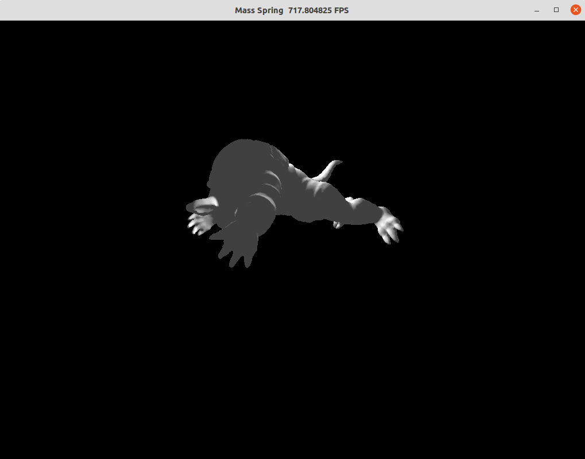

# Mass-Spring System

An explicit mass-spring system (A larger version is in our video).


## How to run:

```
unzip models.zip
```

CUDA:

```
python3 run.py
```

CPU:

```
python3 run.py --cpu
```

## Results



