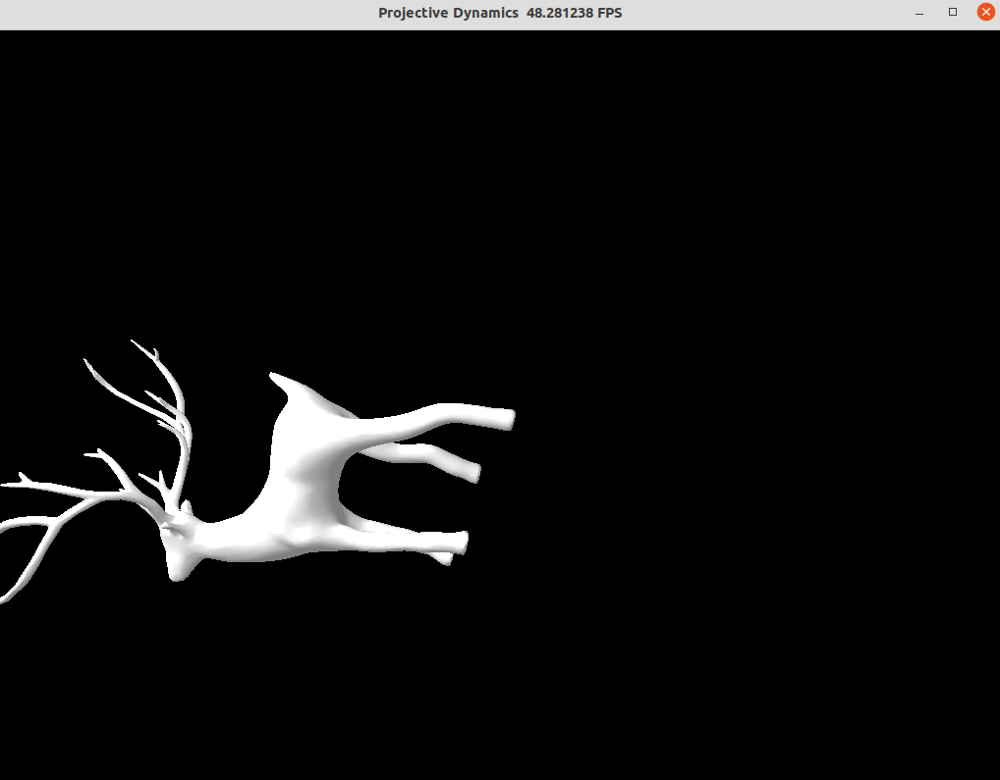

# Projective Dynamics

A projective dynamics simulation of a deer. We randomized all vertices' positions in the initial state (A larger version is in our video).

## How to run:

```
unzip models.zip
```

CUDA:

```
python3 run.py
```

CPU:

```
python3 run.py --cpu
```

## Results



