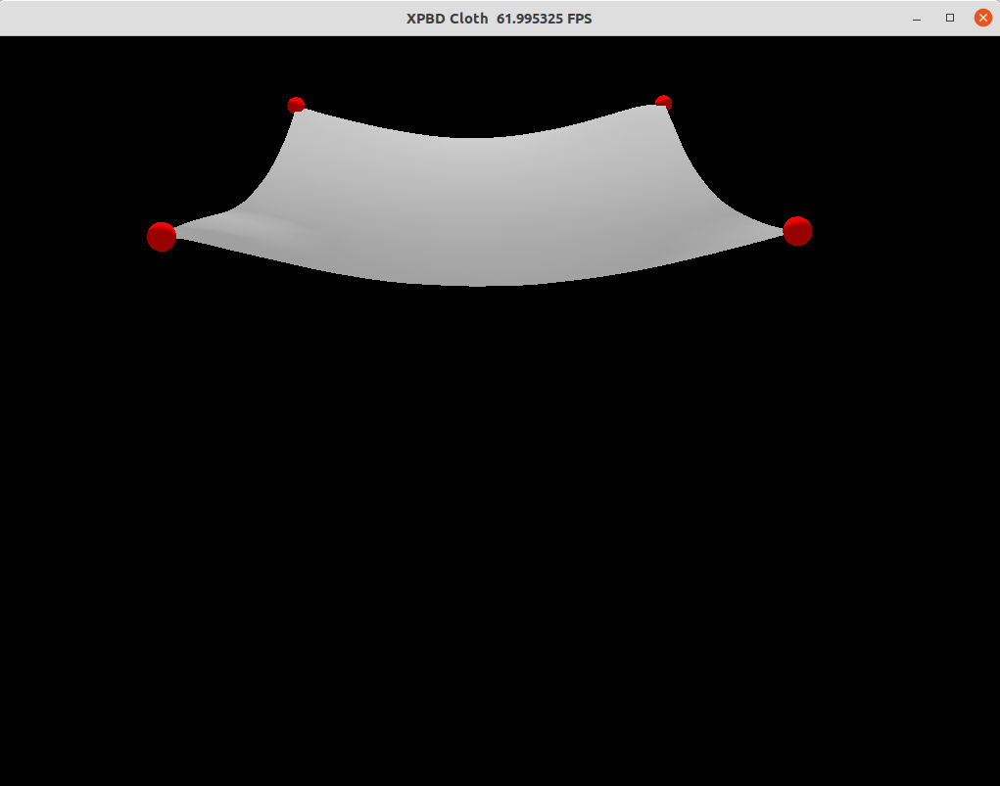

# XPBD Cloth Simulation

An eXtended Position-Based Dynamics simulation of a piece of cloth. We implemented both stretch and bending constraints to better simulate a real cloth (A larger version is in our video).

## How to run:

```
unzip models.zip
```

CUDA:

```
python3 run.py
```

CPU:

```
python3 run.py --cpu
```

## Results



